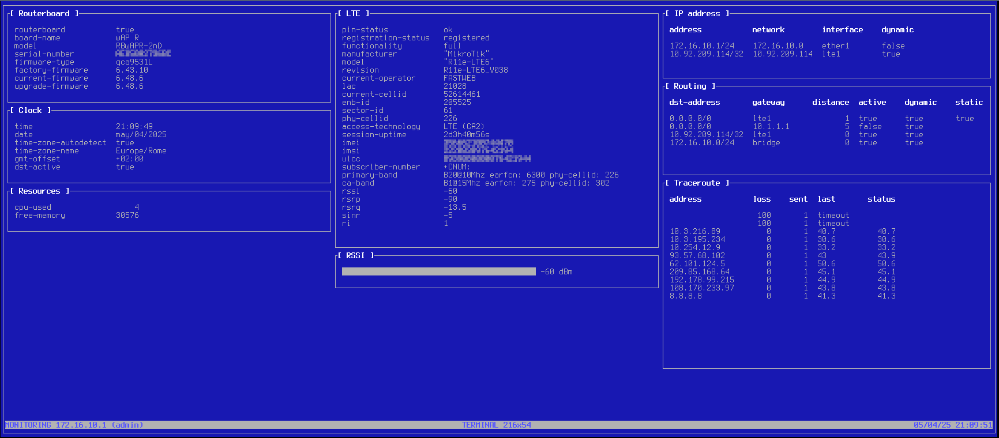

# ROS-Tesseract
MikroTik RouterOS configurable TUI NMS

## Description

ROS Tesseract is an high configurable TUI near realtime NMS. It uses RouterOS API for reading values and displaying it on a TUI (curses). Using a single JSON configuration file you can design your own monitor with your custom graphics.
It supports colors (totally configurable), displaying datas as tables, gauges and plots, dynamic resizing when terminal is resized (when it's too little, boxes that would exit out of the screen are temorarily pruned). 

## Background

This was written from scratch and for my own use, to monitor an LTE router (my broadband backup). Then I thought that often TUIs are underrated and this could be an inspiration. Moreover, also MikroTik routers are underrated (at least in my country, in Italy). 
The name is inspired to sci-fi Insterstellar, because in internal structure I translate a two-dimensional structure into a linear flow, while maintaining the spatial semantics. As the Insterstellar Tesseract is a three dimensional representation of five dimensional space.

NB: I'm not affiliated at all with MikroTik... but if you need consultancy on MikroTik routers (or any other one), on network and software architectures, on Python programming (or with any other language), on GNU/Linux (or any other *nix system), on FOSS... you could hire me :-)

## Configuration

The configuration file could have any name and can be specified as argument on command line, by default the name is the script name with the suffix *.json*.
Main sections are:
 * ros: where must specify router parameters (at least an account that can reat the APIs)
 * boxes: eacth box is a textbox that can display datas as table (multiple readings, eg. an interface, a routing table), gauge (single parameters, eg. LTE interface RSSI), plot ()
 * colors: if colors are supported by terminal, you can define color pairs (foreground and background) that can be used for the main window and for the boxes

## Requirements

This project uses these modules:
 * [asciichartpy](https://github.com/kroitor/asciichart)
 * [ros_api](https://github.com/LaiArturs/RouterOS_API)
 * [tabulate](https://github.com/astanin/python-tabulate)

## TODO

There is a lot to do, yet! Enrich this README, avoid *globals*, further and better exception handling, maybe comments in the code...
